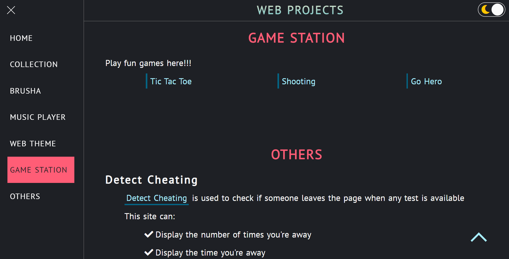

<h1 align="center">yuran-web-pjs</h1>

<strong>Collection of my simple web projects!</strong>

  
  

  
  
  
  
  

<a href="https://yuran1811.github.io/yuran-web-pjs/" target="_blank">Live Demo</a>

## Screenshots

	
	

